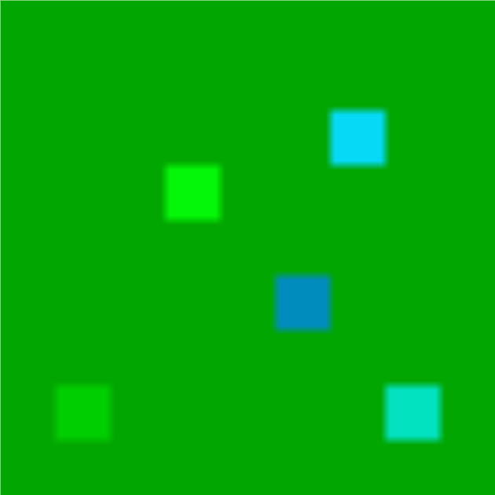

<!-- Improved compatibility of back to top link: See: https://github.com/othneildrew/Best-README-Template/pull/73 -->
<a id="readme-top"></a>
<!--
*** Thanks for checking out the Best-README-Template. If you have a suggestion
*** that would make this better, please fork the repo and create a pull request
*** or simply open an issue with the tag "enhancement".
*** Don't forget to give the project a star!
*** Thanks again! Now go create something AMAZING! :D
-->


<!-- PROJECT SHIELDS -->
<!--
*** I'm using markdown "reference style" links for readability.
*** Reference links are enclosed in brackets [ ] instead of parentheses ( ).
*** See the bottom of this document for the declaration of the reference variables
*** for contributors-url, forks-url, etc. This is an optional, concise syntax you may use.
*** https://www.markdownguide.org/basic-syntax/#reference-style-links
-->
[![Contributors][contributors-shield]][contributors-url]
[![Forks][forks-shield]][forks-url]
[![Stargazers][stars-shield]][stars-url]
[![Issues][issues-shield]][issues-url]


<!-- PROJECT LOGO -->
<br />
<div align="center">
  <a href="https://github.com/cole-ramer/Micro-Empire/">
    
  </a>

<h3 align="center">Micro Empire</h3>

  <p align="center">
    Play as a bacteria colony. Collect nutrients as energy, buy upgrades and fight other colonies to grow bigger.
    <br />
    <a href="https://github.com/cole-ramer/Micro-Empire/"><strong>Explore the docs »</strong></a>
    <br />
    <br />
    <a href="https://github.com/cole-ramer/Micro-Empire/">View Demo</a>
    &middot;
    <a href="https://github.com/cole-ramer/Micro-Empire/issues/new?labels=bug&template=bug-report---.md">Report Bug</a>
    &middot;
    <a href="https://github.com/cole-ramer/Micro-Empire/issues/new?labels=enhancement&template=feature-request---.md">Request Feature</a>
  </p>
</div>


<!-- TABLE OF CONTENTS -->
<details>
  <summary>Table of Contents</summary>
  <ol>
    <li>
      <a href="#about-the-project">About The Project</a>
      <ul>
        <li><a href="#built-with">Built With</a></li>
      </ul>
    </li>
    <li>
      <a href="#getting-started">Getting Started</a>
      <ul>
        <li><a href="#prerequisites">Prerequisites</a></li>
        <li><a href="#installation">Installation</a></li>
      </ul>
    <li><a href="#contact">Contact</a></li>
  </ol>
</details>


<!-- ABOUT THE PROJECT -->
## About The Project
This project was created as the final project of the [Jane Street Immersion Program](https://example.com) by contributors Cole Ramer and May Takahashi.

### Built With

* [![OCaml][OCaml.org]][Ocaml-url]
* [![Dune][Docs.dune.com]][Dune-url]

<p align="right">(<a href="#readme-top">back to top</a>)</p>


<!-- GETTING STARTED -->
## Getting Started

A linux machine is required to run this game.

### Prerequisites

* dune
  ```sh
  opam install dune
  ```

### Installation

1. Clone the repo
   ```sh
   git clone https://github.com/cole-ramer/Micro-Empire/.git
   ```
2. Build the dune file
   ```sh
   dune build
   ```
3. Change git remote url to avoid accidental pushes to base project
   ```sh
   git remote set-url origin github_username/repo_name
   git remote -v # confirm the changes
   ```

<p align="right">(<a href="#readme-top">back to top</a>)</p>

<!-- CONTACT -->
## Contact

Cole Ramer - cole.ramer@gmail.com

Maisha (May) Takahashi - maishatakahashi@gmail.com

Project Link: [https://github.com/cole-ramer/Micro-Empire/](https://github.com/cole-ramer/Micro-Empire/)

<p align="right">(<a href="#readme-top">back to top</a>)</p>


<!-- MARKDOWN LINKS & IMAGES -->
<!-- https://www.markdownguide.org/basic-syntax/#reference-style-links -->
[contributors-shield]: https://img.shields.io/github/contributors/cole-ramer/Micro-Empire.svg?style=for-the-badge
[forks-shield]: https://img.shields.io/github/forks/cole-ramer/Micro-Empire.svg?style=for-the-badge
[stars-shield]: https://img.shields.io/github/stars/cole-ramer/Micro-Empire.svg?style=for-the-badge
[issues-shield]: https://img.shields.io/github/issues/cole-ramer/Micro-Empire.svg?style=for-the-badge

[contributors-url]: https://github.com/cole-ramer/Micro-Empire/graphs/contributors
[forks-url]: https://github.com/cole-ramer/Micro-Empire/network/members
[stars-url]: https://github.com/cole-ramer/Micro-Empire/stargazers
[issues-url]: https://github.com/cole-ramer/Micro-Empire/issues
[linkedin-shield]: https://img.shields.io/badge/-LinkedIn-black.svg?style=for-the-badge&logo=linkedin&colorB=555
[linkedin-url-may]: https://linkedin.com/in/maishatakahashi
[linkedin-url-cole]: https://linkedin.com/in/cole-ramer
[OCaml.org]: https://img.shields.io/badge/OCaml-EB8500?style=for-the-badge&logo=ocaml&logoColor=white
[Ocaml-url]: https://ocaml.org
[Docs.dune.com]: https://img.shields.io/badge/Dune-915A00?style=for-the-badge&logo=dune&logoColor=white
[Dune-url]: https://docs.dune.com